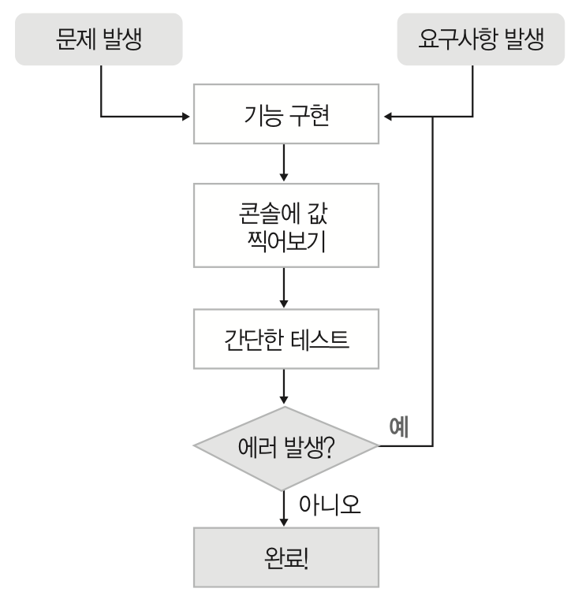
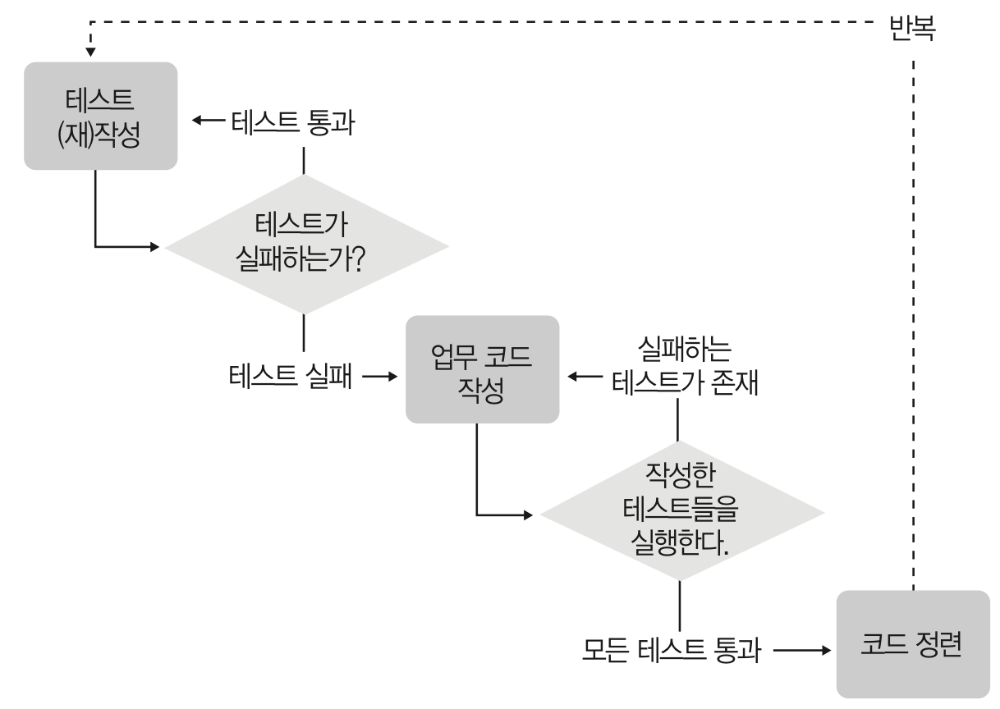

# Chapter01. 테스트 주도 개발
## 1.1 흔하디 흔한 소프트웨어 개발 방식
- 전통적인 개발 방식: 문제영역을 시발점으로 구현 및 검증이 이루어지는 것



#### 전통적인 개발 방식의 문제점
- 개발 기간이 길어질수록 목표의식을 잊기 쉽다.
- 작업 분량이 늘어날수록 확인이 어렵다.
- 개발자의 집중력이 필요하다.
- 논리적인 오류를 찾기가 어렵다.
- 코드의 사용 방법과 변경 이력을 개발자의 기억력에 의존한다.
- 테스트 케이스를 간소화하여 진행하게 된다.
- 코드 수정시 사이드 이펙트를 예상하기 어렵다.
- 테스트를 위해 소스를 수정하는 선행작업이 발생한다.
- 회귀 테스트를 잘 안하게 된다.
- 테스트를 위한 개발자의 리소스가 많이 들어간다.

## 1.2 테스트 주도 개발(TDD)
### TDD란 뭘까?
- 프로그램을 작성하기 전에 테스트를 먼저 작성하는 것 (켄트 백)
- 업무 코드를 작성하기 전에 테스트 코드를 먼저 만드는 것

``` 
프로그램을 작성하기 전에 테스트 먼저 하라! 
Test the program before you write it 
```

#### TDD 개발 접근 방식 
1. 검증 코드 작성
2. 모든 검증 코드를 만족할 때까지 코드를 작성 (개발 종료조건)

## 1.3 테스트 주도 개발의 목표
- 잘 동작하는 깔끔한 코드를 작성하는 것
- 작성된 코드는 명확한 의미를 전달 할 수 있게 작성돼야 함
- 소프트웨어 품질, 유지보수성, 가독성, 비용, 안정성 등 여러 가지 측면의 의미를 내포

``` 
잘 동작하는 깔끔한 코드
Clean code that works
```

## 1.4 테스트 주도 개발의 기원
- XP의 여러 가지 실천 방법 중 하나이다.
- 최근에는 XP와 스크럼(Scrum)을 혼용하여 적용하는 형태로 쓰인다.
``` 
애자일 개발 방식 중 하나인 XP의 실천 방식 중 하나
```

* XP: 2000년대 초반에 급부상한 애자일 소프트웨어 개발론으로 TDD, 짝 프로그래밍(Pair Programming), 일일 빌드(Daily Build), 지속적인 통합(Continuous Integration) 등 다양한 실천 방법을 제시
* 애자일 개발: 민첩하고 유연하게 개발에 임하며, 개발에 집중할 수 있도록 개발환경을 조성하는 방식 
* 전통적인 개발: 소프트웨어 개발 업무 보다 문서와 프로세스와 같은 부가적인 부분들에 집중하는 방식

### 대표적인 애자일 기법
- 단위 테스트(Unit Testing)
- 지속적인 통합(Continuous Integration)
- 자동화된 빌드(Automated Builds)
- 테스트 주도 개발(TDD)
- 짝 프로그래밍(Pair Programming)
  
## 1.5 개발에 있어 테스트 주도 개발의 위치
- 개발자 테스트(Programmer Test), 단위 테스트(Unit Test)에 해당한다.
- 메소드 단위로 테스트를 수행하여 이후에 발생하는 테스트 단계에서 결함발생 비용을 줄일 수 있다.
``` 
개발자가 처음으로 수행하는 테스트
```

* 개발자 테스트(Programmer Test): 개발자가 자신을 위해 처음으로 수행하는 테스트
* 단위 테스트(Unit Test): TDD에서의 단위 테스트는 메소드 단위 테스트를 의미
* 전통적인 단위 테스트: 사용자 측면에서 제품의 기능을 테스트하는 것을 의미

## 1.6 테스트 주도 개발의 진행 방식
- 질문(Ask): 테스트를 작성한다.
- 응답(Respond): 테스트를 통과하는 코드를 작성한다.
- 정제(Refine): 코드를 리팩토링한다.
- 반복(Repeat): '질문 - 응답 - 정제'를 반복한다.



## 1.7 실습 먼저 시작해보기
### TDD 실습 방법
1. 구현해야 하는 기능과 유의사항 작성
2. 테스트 케이스 작성
    - 구현 대상 클래스의 외형에 해당하는 메소드들을 먼저 만들고 테스트 케이스를 일괄적으로 만드는 방식 **(권장)**
    - 테스트 케이스를 하나씩 추가해가면서 구현 클래스를 점진적으로 만드는 방식
3. 리팩토링: 이해하기 쉽고, 변경에 용이한 구조로 소스코드를 개선하는 것
    - 소스의 가독성이 적절한가?
    - 중복된 코드는 없는가?
    - 이름이 잘못 부여된 메소드나 변수면은 없는가?
    - 구조의 개선이 필요한 부분은 없는가?  

### TDD 원칙
- 하나의 테스트 케이스가 하나의 기능(메소드)을 테스트 해야 한다.
- 자주 실패를 경험하도록 유도한다.
  
### JUnit 
- JUnit은 단위 테스트를 위한 테스트 프레임워크 이다.
- JUnit은 테스트 성공 여부를 GUI를 통해 제공한다.
- JUnit4는 Java SDK 5.0+ 부터 지원한다.
 
## 1.8 TDD의 장점
- 개발의 방향성 유지
- 품질 높은 소프트웨어 모듈 보유
- 자동화된 단위 테스트 케이스
- 사용설명서 & 의사소통의 수단
- 설계 개선
- 잦은 성공을 통한 성취감

### 엉클 밥의 TDD 원칙
- 실패하는 테스트를 작성하기 전에는 절대로 제품 코드를 작성하지 않는다.
- 실패하는 테스트 코드를 한 번에 하나 이상 작성하지 않는다. 
- 현재 실패하고 있는 테스트를 통과하기에 충분할 정도로 넘어서는 제품 코드를 작성하지 않는다.